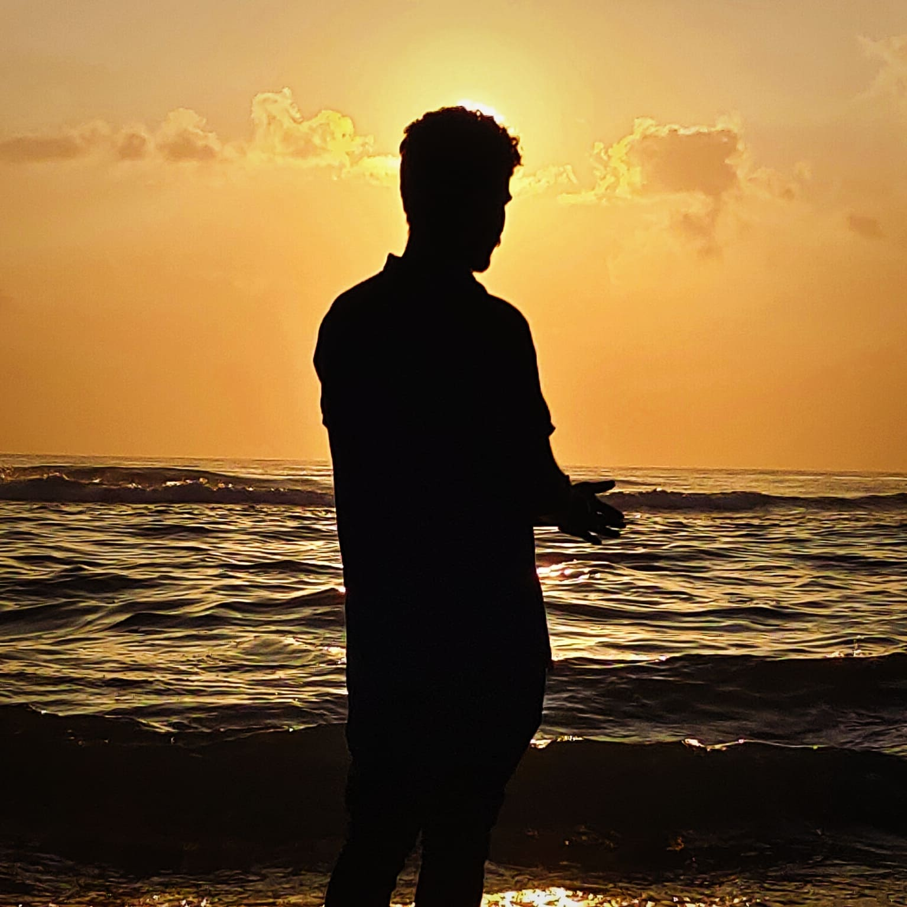

# Welcome to My Website! 🎉

Where your time is wasted in the most entertaining way possible. 😂
---

 <!-- Add your profile image link here -->

## VASANTH B

**Pre-Final Year Student - Rajalakshmi Engineering College**  
*Video Editor | Graphic Designer | Tech Enthusiast | IEEE SBREC*

---

## About Me

Hey there! I’m **Vasanth** 👋 – a tech enthusiast 💻, web developer 🌐, and video editor 🎬. I’m passionate about turning ideas into reality by creating dynamic and user-friendly websites, exploring new technologies, and pushing creative boundaries.

Whether it’s coding, designing, or editing, I love making things that are both fun and functional. When I’m not at my computer, you’ll probably find me brainstorming new projects, attending events, or working on something that fuels my curiosity.

**Let’s build something amazing! 🚀**

---

## Skills

Mastering the art of technology and creativity, this section showcases the tools and expertise that shape every project.

- Web Development (HTML, CSS, JavaScript)
- Video Editing (Adobe Premiere Pro, After Effects)
- Graphic Design (Photoshop, Illustrator)
- UI/UX Design
- Team Collaboration & Leadership

---

## Projects

From ideation to execution, explore innovative solutions and groundbreaking ideas that bring visions to life.

[Explore Projects](#) <!-- Link to your projects or portfolio -->

---

## Works & Freelance

A collection of impactful works that reflect dedication, creativity, and a passion for excellence.

[Explore Works](#) <!-- Link to your works or freelance portfolio -->

---

## Contact Me

Let’s connect! Feel free to reach out for collaborations, queries, or just to say hello.

[Contact Me](#) <!-- Add your contact details or form link -->

---

© 2024 Vasanth B | All Rights Reserved